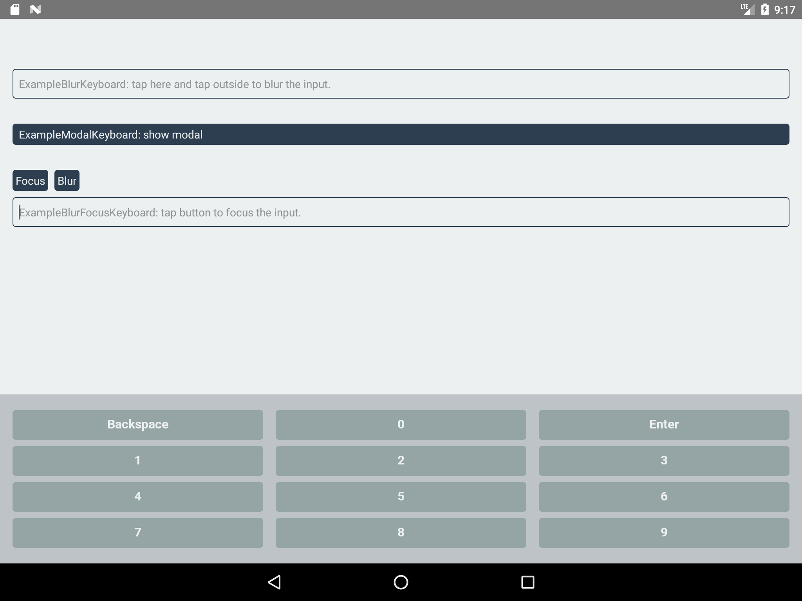
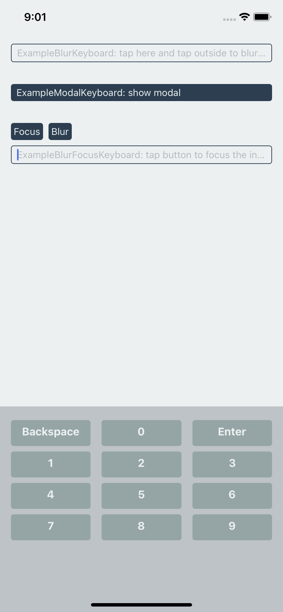

# rn-keyboard

This module shall provide you:

- [x] Customize Android/IOS soft keyboard by using React Native Component on both Android & IOS.

  - [x] On Android, we run a parallel activity & hide the default keyboard away.
  - [x] On IOS, we replace the default keyboard view with your custom keyboard view.

- [x] Custom Android Keyboard now show front of your modal. ([Click here to see the discussion](https://stackoverflow.com/questions/49981373/react-native-modal-dialog-hides-custom-keyboard))

- [x] Deal with the flickering issue of Android Keyboard.
  - [x] Discussions about flickering issue: [format value](https://github.com/facebook/react-native/issues/24585), [numeric input](https://github.com/facebook/react-native/issues/24585). I have try the maxLength solution but I got no luck with issue [Keyboard on Android 10 does not trigger](https://github.com/facebook/react-native/issues/18339). Therefore, this could be a solution to solve the issue.

## Prerequisites

The specific React Native version must be satisfied to make your custom keyboard show up on Android & IOS.

- react-native >= 0.64.0

## Installation

```sh
yarn add rn-keyboard
```

## Result

###### Android (Nexus 9)



###### IOS (IPhone 11, IOS 15.4)



## Usage

Please add those lines to your `index.js` at root folder:

```js
// index.js (root folder)

...
import RnKeyboard from 'rn-keyboard'; // <-- Import here

RnKeyboard.registerComponent(); // <-- Add this line
AppRegistry.registerComponent(appName, () => App);
```

Then, please register your keyboard at root App component:

```js
// App.js (root container)
...
import RnKeyboard from 'rn-keyboard'; // <-- Import here
import CustomKeyboard from 'path/to/your/custom/keyboard/in/your/project';

const App = () => {
    React.useEffect(() => {
        RnKeyboard.registerKeyboard("Your custom keyboard type", CustomKeyboard); // <-- Add this to your root container's componentDidMount
    }, []);

    return (
        <>
            ...
            {/* Add this to avoid keyboard */}
            <RnKeyboard.Spacer />
        </>
    )
}
```

Then, create your own keyboard:

```js
// CustomKeyboard.tsx (this is just an example)
import * as React from 'react';
import {
  StyleSheet,
  TouchableOpacity,
  Text,
  View,
  Dimensions,
} from 'react-native';
import RnKeyboard from 'rn-keyboard';

const width = Dimensions.get('window').width;
const buttonList = (() => {
  const result: string[][] = [
    ['Backspace', '0', 'Enter'],
    ['1', '2', '3'],
    ['4', '5', '6'],
    ['7', '8', '9'],
  ];
  return result.map((row, rowIdx) => ({
    rowIdx,
    buttons: row.map((label) => ({ value: label, label })),
  }));
})();

const RnKeyboardNumeric = () => {
  const insert = (type: string) => async () => {
    try {
      const inputId = RnKeyboard.getFocusId();
      switch (type) {
        case 'Backspace':
          await RnKeyboard.backspace(inputId);
          return;

        case 'Enter':
          await RnKeyboard.submit(inputId);
          return;

        default:
          await RnKeyboard.insert(inputId, type);
      }
    } catch (err) {
      /** @todo handle error here */
    }
  };

  return (
    <View style={styles.container}>
      {buttonList.map((row) => (
        <View key={`row-${row.rowIdx}`}>
          {row.buttons.map((button) => (
            <TouchableOpacity
              activeOpacity={0.9}
              onPress={insert(button.value)}
              key={`button-${row.rowIdx}-${button.value}`}
            >
              <Text>{button.label}</Text>
            </TouchableOpacity>
          ))}
        </View>
      ))}
    </View>
  );
};

const styles = StyleSheet.create({
  container: {
    flex: 1,
    backgroundColor: '#bdc3c7',
    paddingVertical: 16,
  },
});
```

Finally, you use our custom input in your custom screen to see your Keyboard show up:

```js
// In your custom screen
...

const CustomScreen = () => {
  return (
    <>
        <RnKeyboard.Input
            rnKeyboardType={"Your registered custom keyboard type from App.js"}
            ... // TextInput props go here
        />
    </>
  );
};
```

## Contributing

See the [contributing guide](CONTRIBUTING.md) to learn how to contribute to the repository and the development workflow.

## License

MIT
